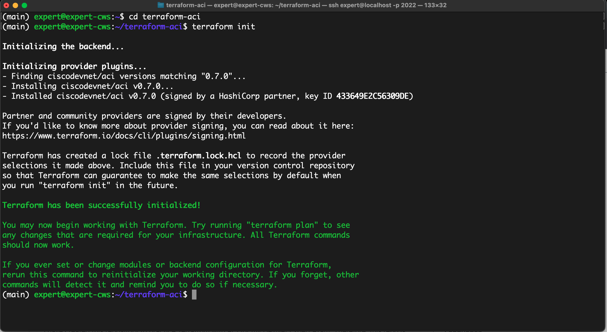

# Cisco ACI Programmability with Terraform

## Introduction
I have created this repository to practice Terrafrom with ACI for my DevNet Expert exam, Therefore, this repo is using the same versions for Terraform and ACI provider which are mentioned in DevNet Expert [Equipment and Software list](https://learningnetwork.cisco.com/s/article/devnet-expert-equipment-and-software-list).


```bash
Terraform 1.0
    CiscoDevNet/aci v0.7
```

You can find the Terraform ACI provider documentation [here](https://registry.terraform.io/providers/CiscoDevNet/aci/latest/docs).

I have also used Cisco Always-on ACI Simulator running Version 5.2(1g) in this project, check this [link](https://developer.cisco.com/docs/aci/#!sandbox/aci-sandboxes) for more details.

## Download Terraform
Check out the this [link](https://www.terraform.io/downloads) to download and install the Terraform on different operating systems.

If you are using Cisco DevNet Expert Candidate Work Satation like me, then Terraform v1.0.11 is already installed there. 

```bash
(main) expert@expert-cws:~/terraform-aci$ terraform --version
Terraform v1.0.11
on linux_amd64
+ provider registry.terraform.io/ciscodevnet/aci v0.7.0

Your version of Terraform is out of date! The latest version
is 1.2.6. You can update by downloading from https://www.terraform.io/downloads.html
(main) expert@expert-cws:~/terraform-aci$ 
```

## Usage 

__Clone this repository__
```bash
$ git clone https://github.com/muhammad-rafi/terraform-aci.git
```

__Go to the folder 'terraform-aci' you cloned__
```bash
$ cd terraform-aci
```

__Run 'terraform init' to initialize__

```bash
$ terraform init
```

See the screenshot below
 

After initializing the Terraform, you can either leave the variable as I defined or you can set your own variables in [variables.tf](variables.tf) and run the following commands to see the Terraform with ACI in action. 

- terraform plan
- terraform apply -auto-approve

You may also login to the Cisco Always-on ACI Simulator sandbox and confirm the configurations have been pushed sucessfully. 

I have taken few screenshots whilst creating this repository, please check them out in the [images](images) folder.

## Main Terraform commands

- `terraform init` - Initialize your Terraform directory to be able to execute your plan. Terraform downloads all defined providers in your main.tf file.

- `terraform plan` - Analyze your main.tf file and compare it to the state file terraform.tfstate (if it exists) to determine what part of the plan must be deployed, updated, or destroyed.

- `terraform apply` - Apply the changes described by the plan command to the third-party systems and update the terraform.tfstate file with the current configuration state for the resources described in the plan.

- `terraform destroy` - Remove or "unconfigure" all the resources previously deployed. Terraform tracks those resources by using the state file terraform.tfstate.

- `terraform validate` - Check whether the configuration is valid

- `terraform fmt --recursive` - To format all the terraform .tf files recursively.

You may also use `-auto-approve` flag with `terraform apply` or `terraform destroy` if you know exactly what are you doing as it will not prompt to answer 'Yes or No' to make changes.

In addtion to that, if you like to generate a resource graph, you can use the following command. You will require 'graphviz' installed.

```bash
$ terraform graph | dot -Tpng > terra-resource-graph.png
```

## Task - Provision Following Resources via Terraform

- ACI Tenant - 'tenant_rafi'
- ACI Tenant VRF - 'dev_vrf'
- ACI Tenant Bridge Domain - 'web_bd & db_bd'
- ACI Tenant Bridge Domain Subnets - '10.100.21.1/24 & 10.100.22.1/24'
- ACI Tenant Application Profile - 'ap_prof
- ACI Tenant Endpoint Groups (EPGs) - 'web_epg & db_epg'
- ACI Tenant Filters and Contracts to allow traffic (https & sql) between EPGs.

## Terraform ACI resources used 

- aci_tenant
- aci_vrf
- aci_bridge_domain
- aci_subnet
- aci_application_profile
- aci_application_epg
- aci_vmm_domain
- aci_filter
- aci_filter_entry
- aci_contract
- aci_contract_subject

work in progress for L3out ...

## ISSUES

You may notice, I don't have any variable definitions in `terraform.tfvars` file, this is because I am using the default values for the variables but you can move them to `terraform.tfvars` file and leave the variable declarations in `variables.tf` file. 

## References
[Muhammad Rafi](https://www.linkedin.com/in/muhammad-rafi-0a37a248/)

## References

[Cisco ACI terraform provider documentation](https://registry.terraform.io/providers/CiscoDevNet/aci/latest/docs)

[ACI Programmability](https://developer.cisco.com/learning/tracks/aci-programmability/)

[ACI Programmability - Introduction to ACI and Terraform](https://developer.cisco.com/learning/tracks/aci-programmability/terraform-aci-intro/)

